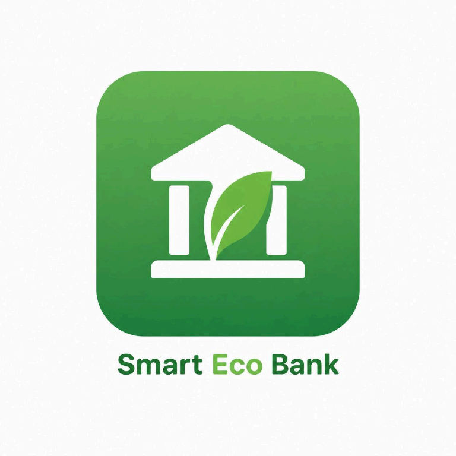
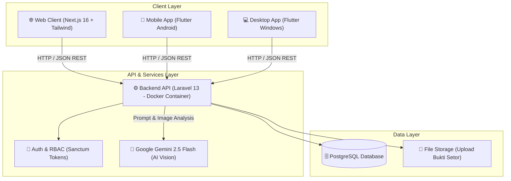

<p align="center">
  
</p>

<h1 align="center">🌿 Smart Eco Bank</h1>

<p align="center">
  <strong>Solusi Bank Sampah Digital Berbasis AI & Multiplatform</strong><br>
  <em>Platform modern yang mengintegrasikan Web App, Mobile (Android), dan Desktop (Windows) dengan kecerdasan buatan (Gemini AI Vision) untuk mempermudah pemilahan, penyetoran, dan konversi sampah menjadi reward bernilai ekonomi.</em>
</p>

<p align="center">
  <a href="https://github.com/arjunsujarwo/smart-eco-bank/releases/tag/v1.0.0">
    
  </a>
  
  
  
  
  
</p>

---

## 🎯 Panduan Cepat Penguji / HRD & Reviewer (Quick Trial)

> **Sedang mereview portofolio ini?** Anda tidak perlu repot melakukan setup database atau mengompilasi kode dari nol. Anda dapat langsung mengunduh dan menguji coba aplikasi secara mandiri!

### 📥 Unduh Langsung Aplikasi Siap Pakai:
| Perangkat | Format | Ukuran | Link Unduhan Resmi | Petunjuk Singkat |
| :--- | :---: | :---: | :--- | :--- |
| 📱 **Android Smartphone** | `.apk` | ~53 MB | [**Download Android APK**](https://github.com/arjunsujarwo/smart-eco-bank/releases/download/v1.0.0/smart-eco-bank-android-v1.0.0.apk) | Unduh & pasang di HP Android (izinkan *Install unknown apps*). |
| 💻 **PC / Laptop Windows** | `.zip` | ~13 MB | [**Download Windows ZIP**](https://github.com/arjunsujarwo/smart-eco-bank/releases/download/v1.0.0/smart-eco-bank-windows-x64-v1.0.0.zip) | Ekstrak ZIP, lalu klik dua kali pada `smart_eco_bank.exe`. |

### 🔑 Akun Uji Coba Demo (Demo Credentials):
Aplikasi mobile & desktop telah dibekali fitur **Dual-Mode (Offline Mock & Live API)**. Tanpa backend pun aplikasi langsung dapat dieksplorasi secara lancar dengan akun berikut:

| Peran (Role) | Email | Password | Hak Akses & Fitur |
| :--- | :--- | :--- | :--- |
| **Nasabah (User)** | `user@example.com` | `password` | Setor sampah, AI Scanner, riwayat transaksi, katalog & penukaran reward, notifikasi. |
| **Administrator** | `admin@example.com` | `password` | Verifikasi fisik setoran nasabah, approval penukaran reward, pantau stok & kapasitas posko. |

---

## 💡 Latar Belakang & Nilai Proyek (Why This Project?)

Pengelolaan sampah konvensional seringkali terkendala oleh rendahnya motivasi masyarakat dalam memilah sampah dan proses verifikasi manual yang lambat di posko bank sampah.

**Smart Eco Bank hadir memecahkan masalah ini dengan pendekatan teknologi:**
1. **Gamifikasi & Insentif Nyata:** Sampah yang disetor dikonversi menjadi *Green Points* yang dapat ditukar dengan merchandise ramah lingkungan (Tumbler *reusable*, tas kanvas, topi).
2. **Kecerdasan Buatan (AI Vision):** Nasabah cukup memotret sampah, sistem AI otomatis mendeteksi kategori (Organik / Anorganik) serta mengestimasi berat dan poin.
3. **Multiplatform Terintegrasi:** Nasabah dapat mengakses melalui Web dan Mobile, staf operasional posko dapat memakai Desktop atau Admin Web.

---

## 🌟 Fitur Unggulan (Core Features)

```
┌────────────────────────────────────────────────────────────────────────┐
│                        SMART ECO BANK ECOSYSTEM                        │
├───────────────────────┬────────────────────────┬───────────────────────┤
│    👤 NASABAH / USER  │   🤖 AI WASTE SCANNER  │    🛡️ ADMINISTRATOR    │
│  - Dashboard Poin     │  - Gemini Vision AI    │  - Verifikasi Setoran │
│  - Setor & Drop-off   │  - Estimasi Bobot Gram │  - Manajemen Hadiah   │
│  - Tukar Hadiah/Kupon │  - Klasifikasi Sampah  │  - Monitoring Posko   │
│  - Riwayat & Mutasi   │  - Deteksi Fraud/Objek │  - Manajemen Pengguna │
└───────────────────────┴────────────────────────┴───────────────────────┘
```

* 🤖 **AI Waste Classifier (Google Gemini Vision 2.5 Flash):** Pemindaian foto sampah secara real-time dengan kemampuan mendeteksi jenis material (PET, HDPE, Kertas, Kaleng) dan menolak foto non-sampah secara otomatis.
* 📦 **Sistem Katalog & Penukaran Reward:** Manajemen stok hadiah real-time dengan status verifikasi pengambilan di posko terdekat.
* 📍 **Peta Lokasi Posko Penyetoran:** Informasi titik posko drop-off terdekat, jam operasional, dan kapasitas penampungan.
* ⚡ **Desain Responsif & Interaktif:** Dibangun dengan Tailwind CSS di web, efek suara interaktif saat aksi berhasil, dan dukungan multi-bahasa (i18n).
* 🛡️ **Role-Based Access Control (RBAC):** Pemisahan hak akses yang ketat antara Nasabah dan Administrator via Laravel Sanctum.

---

## 📐 Arsitektur Sistem (System Architecture)



---

## 📂 Struktur Repositori

Repository ini menggabungkan seluruh lapisan ekosistem Smart Eco Bank (*monorepo*):

| Direktori | Deskripsi | Teknologi Utama |
| :--- | :--- | :--- |
| [`/frontend-web`](./frontend-web) | Portal web untuk nasabah dan panel manajemen admin | Next.js 16, TypeScript, Tailwind CSS, i18next |
| [`/frontend-mobile`](./frontend-mobile) | Aplikasi multiplatform untuk perangkat mobile & desktop | Flutter 3.44, Dart, Provider State Management |
| [`/backend`](./backend) | REST API, autentikasi, logika bisnis, dan integrasi AI | Laravel 13, PHP 8.3, PostgreSQL, Docker, Gemini AI |

---

## 🛠️ Panduan Menjalankan Secara Lokal (Developer Quick Start)

Bagi developer yang ingin menjalankan dan mengembangkan seluruh source code di komputer lokal:

### 1. Prasyarat Sistem
* PHP >= 8.3 & Composer
* Node.js >= 20.x & npm
* Flutter SDK >= 3.27
* Docker (opsional untuk containerized deployment)

---

### 2. Menjalankan Backend (Laravel API)
```bash
cd backend
composer install
cp .env.example .env
php artisan key:generate
php artisan migrate --seed
php artisan serve
# Backend akan aktif di http://127.0.0.1:8000
```
> *Tips:* Isi `GEMINI_API_KEY` di file `.env` untuk mengaktifkan fitur AI Scanner dengan model Google Gemini secara live.

---

### 3. Menjalankan Frontend Web (Next.js)
```bash
cd frontend-web
npm install
npm run dev
# Buka di browser: http://localhost:3000
```

---

### 4. Menjalankan Mobile / Desktop (Flutter)
```bash
cd frontend-mobile
flutter pub get

# Jalankan versi Windows Desktop (Mode Offline Mock)
flutter run -d windows

# Atau hubungkan langsung ke Backend Laravel lokal
flutter run -d windows --dart-define=SEB_API_BASE_URL=http://127.0.0.1:8000/api
```

---

## 🚀 Deployment & DevOps

* **Backend:** Dilengkapi dengan [`Dockerfile`](./backend/Dockerfile) dan konfigurasi blueprint [`render.yaml`](./render.yaml) yang siap dideploy ke **Render.com** atau **Railway**.
* **Frontend Web:** Siap dideploy instan ke **Vercel** hanya dengan menghubungkan repository GitHub dan memilih root directory `frontend-web`.
* **CI/CD & Releases:** File kompilasi Android APK dan Windows Desktop dikelola secara otomatis melalui **GitHub Releases**.

---

## 👨‍💻 Pengembang (Author)

Proyek ini dikembangkan dengan penuh dedikasi sebagai portofolio *fullstack multiplatform & AI engineering*:

* **Nama:** **Arjun Sujarwo**
* **GitHub:** [@arjunsujarwo](https://github.com/arjunsujarwo)
* **Repository:** [smart-eco-bank](https://github.com/arjunsujarwo/smart-eco-bank)

---

<p align="center">
  <sub>Dibangun dengan kepedulian terhadap kelestarian lingkungan dan kemajuan teknologi hijau 🌱</sub>
</p>
